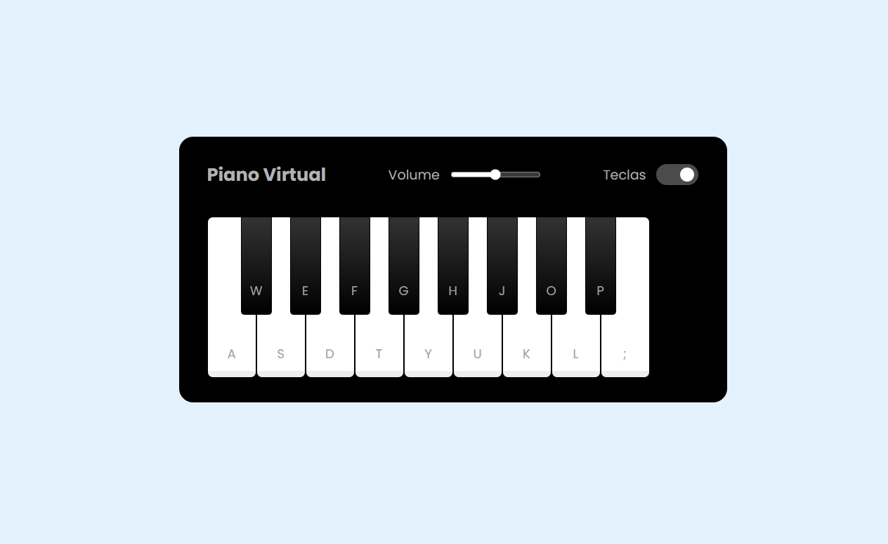

# 🎹 Projeto Piano

Este projeto foi desenvolvido com o objetivo de praticar conceitos fundamentais de **JavaScript, HTML e CSS**.  
A aplicação simula um piano interativo no navegador, onde cada tecla pode ser acionada para produzir um som correspondente.

---

## 🚀 Aprendizados

Durante o desenvolvimento, foram explorados os seguintes conceitos:

- **Manipulação de DOM** – Acesso e modificação dinâmica dos elementos da página.
- **Tratamento de elementos em HTML** – Estruturação das teclas e organização da interface.
- **Adição de classes dinamicamente** – Inclusão e remoção de estilos via JavaScript.
- **Uso do `toggle` em classes** – Alteração de estados visuais de forma prática.
- **Event Listeners** – Captura e resposta a eventos de clique e teclado.
- **Pseudo-elementos em CSS** – Estilização extra para enriquecer a interface sem adicionar novos elementos no HTML.

---

## 🛠️ Tecnologias Utilizadas

- **HTML5**
- **CSS3**
- **JavaScript (ES6+)**

---

## 🎯 Objetivo

O projeto teve como foco o aprendizado e a prática, consolidando fundamentos essenciais do **desenvolvimento web** e da **interatividade em páginas estáticas**.

---

## 📷 Demonstração



---

## 📌 Como Executar

1. Clone este repositório:
   ```bash
   git clone https://github.com/phaelteixeira/piano.git
   ```
2. Abra o arquivo index.html no navegador.

3. Explore o piano interativo!
